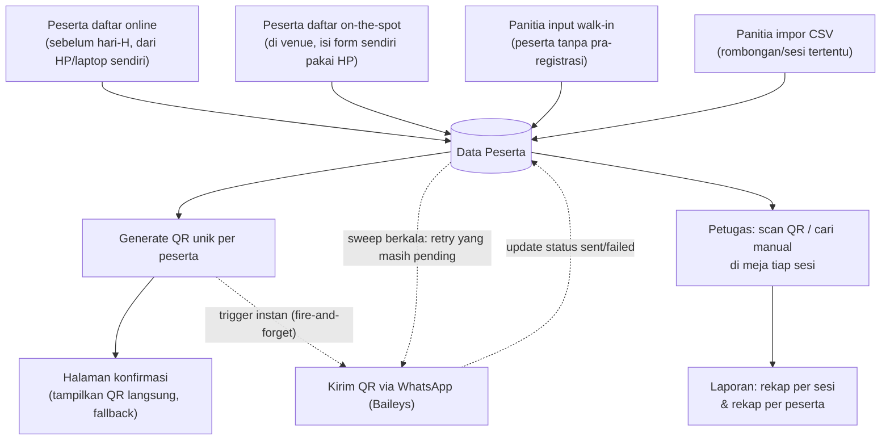

# Alur Proses Bisnis — JHD26 Registrasi & Absensi

Dokumen ini menjelaskan proses bisnis dan alur kerja sistem, dari peserta mendaftar
sampai laporan akhir dibuat. Untuk detail teknis (instalasi, arsitektur, API),
lihat `README.md`. Untuk riwayat perubahan, lihat `CHANGELOG.md`.

## Aktor

| Aktor | Peran |
|---|---|
| **Calon peserta** | Mengisi form registrasi (online maupun on-the-spot di venue) |
| **Panitia (admin_event/super_admin)** | Kelola event/ruangan/sesi/peserta, input walk-in & impor CSV, lihat laporan |
| **Petugas absensi (petugas)** | Scan QR / cari manual di meja registrasi tiap sesi |

## Alur keseluruhan



---

## 1. Registrasi Online (sebelum hari-H)

Peserta mengetahui event dari promosi/undangan, membuka link registrasi
(`https://registrasi.jhd26.online/register`) dari HP/laptop sendiri, kapan saja
sebelum event berlangsung.

**Langkah:**
1. Buka `/register` — isi nama, no. HP/WA, email (opsional), institusi (opsional).
2. Pilih satu atau lebih sesi dari daftar (dikelompokkan per tanggal & jam).
   Sesi yang sudah penuh tampil "Penuh"; sesi yang bentrok waktu dengan sesi
   lain yang sudah dipilih otomatis tampil "Bentrok" dan tidak bisa dipilih.
3. Centang persetujuan pemrosesan data pribadi (wajib, sesuai UU PDP).
4. Selesaikan verifikasi Cloudflare Turnstile (anti-bot).
5. Submit → sistem memvalidasi kapasitas & bentrok waktu sekali lagi di
   server (mencegah race condition kalau ada yang daftar bersamaan),
   lalu generate QR code unik.
6. Peserta diarahkan ke **halaman konfirmasi** yang menampilkan QR langsung
   (fallback kalau WA belum sempat terkirim) beserta daftar sesi yang diikuti.
7. Sistem langsung mencoba kirim QR via WhatsApp saat itu juga (hampir instan),
   tanpa menunggu/menghambat langkah #6 di atas. Kalau gagal (jaringan/WA
   bermasalah), status ditandai `pending`/`failed` dan akan dicoba ulang oleh
   sweep berkala.

**Ditolak jika:** sesi penuh, sesi bentrok waktu dengan sesi lain yang dipilih,
no. HP sudah terdaftar di event ini (cegah duplikasi), consent tidak dicentang,
atau verifikasi Turnstile gagal.

---

## 2. Registrasi On-the-Spot (peserta isi sendiri di venue)

Sama persis dengan alur #1 secara teknis (form publik yang sama, `/register`) —
bedanya hanya **kapan dan di mana** peserta mengisinya: langsung di venue hari-H,
biasanya lewat HP sendiri setelah scan QR poster/banner registrasi yang
ditempel di meja registrasi, atau dibantu panitia menunjukkan link-nya.

**Kapan dipakai:** peserta datang tanpa pra-registrasi tapi punya HP & mau
mendaftar sendiri (lebih cepat daripada antre di meja walk-in panitia).

**Perbedaan praktis dari alur walk-in panitia (#3):** peserta yang input
sendiri, bukan panitia — jadi tidak membebani antrian meja registrasi manual.

---

## 3. Registrasi Walk-in oleh Panitia

Untuk peserta yang tidak punya/tidak nyaman pakai HP sendiri, atau datang
berombongan kecil dan lebih cepat dibantu panitia langsung.

**Langkah (panitia, login sebagai admin_event/super_admin):**
1. Buka `/admin/peserta/tambah`.
2. Isi data peserta (nama, no. HP, email, institusi).
3. Pilih sesi — UI sama dengan form publik: scrollable, dikelompokkan per
   tanggal/jam, sesi bentrok otomatis ter-disable.
4. Centang konfirmasi persetujuan data pribadi **atas nama peserta**
   (panitia menyatakan sudah mendapat persetujuan lisan/tertulis dari
   peserta yang bersangkutan).
5. Simpan → peserta langsung masuk ke sistem dengan QR ter-generate, dan WA
   langsung dicoba dikirim saat itu juga, sama seperti registrasi mandiri.
6. Panitia bisa langsung membuka **"Lihat QR"** peserta itu dari
   `/admin/peserta` untuk ditunjukkan/di-scan di tempat kalau peserta mau
   langsung ikut sesi saat itu juga, tanpa menunggu WA terkirim.

**Validasi sama seperti alur #1**: kapasitas, bentrok waktu, duplikasi
no. HP, consent wajib.

---

## 4. Registrasi Massal via Impor CSV oleh Panitia

Dipakai untuk rombongan/undangan khusus yang datanya sudah terkumpul di luar
sistem (misalnya dari form pendaftaran internal komunitas/organisasi mitra),
supaya tidak perlu diinput satu-satu.

**Contoh kasus nyata:** organisasi mitra mengirim daftar nama peserta yang
akan ikut sesi **"Seminar SAFEnet Triwulan II 2026: Situasi Hak Digital"**
dan/atau **"Seminar CRI: Meaningful Connectivity for Community Resilience"**.

**Format CSV** (kolom: `nama, no_hp, email, institusi, sesi` — kolom `sesi`
diisi *nama sesi persis* seperti di `/admin/sesi`, dipisah koma kalau peserta
ikut lebih dari satu sesi):

```csv
nama,no_hp,email,institusi,sesi
Ahmad Fauzi,081234567890,ahmad@example.com,Universitas Gadjah Mada,Seminar SAFEnet Triwulan II 2026: Situasi Hak Digital
Siti Nurhaliza,081234567891,,LSM Perempuan Yogyakarta,Seminar CRI: Meaningful Connectivity for Community Resilience
Budi Santoso,081234567892,budi@mail.com,,"Seminar SAFEnet Triwulan II 2026: Situasi Hak Digital,Seminar CRI: Meaningful Connectivity for Community Resilience"
```

> Baris terakhir menunjukkan satu peserta ikut **dua sesi sekaligus** — nama
> sesi dipisah koma di dalam satu sel (perlu tanda kutip di CSV kalau
> mengandung koma).

**Langkah (panitia):**
1. Siapkan file CSV sesuai format di atas (nama sesi harus cocok persis
   dengan yang terdaftar di sistem — cek dulu di `/admin/sesi`).
2. Buka `/admin/peserta`, di kartu **"Impor Peserta (CSV)"**: pilih file,
   centang konfirmasi persetujuan data pribadi untuk **seluruh peserta**
   dalam file tersebut, klik **Impor**.
3. Sistem memproses baris per baris. Setiap baris divalidasi sama seperti
   registrasi manual (kapasitas, bentrok waktu, duplikasi no. HP, nama sesi
   harus ditemukan) — **baris yang gagal tidak menggagalkan baris lain**,
   hasil akhir menampilkan ringkasan "N peserta berhasil diimpor" plus
   daftar baris yang gagal beserta alasannya (mis. "Baris 4: sesi tidak
   ditemukan", "Baris 7: sudah penuh").
4. Peserta yang berhasil diimpor akan dikirimi QR via WhatsApp lewat sweep
   berkala (bukan trigger instan seperti registrasi tunggal — sengaja
   dijeda satu-satu untuk hindari lonjakan kirim WA beruntun kalau CSV-nya
   berisi banyak baris sekaligus).

---

## 5. Absensi di Venue (per Sesi)

Setiap sesi punya meja/titik absensi sendiri (sesuai ruangan R1-R5 masing-masing),
dijaga oleh satu atau lebih petugas.

**Langkah (petugas, login role `petugas`):**
1. Buka `/absensi/scan` dari browser HP.
2. Pilih **sesi aktif** dari dropdown (harus sesuai sesi yang sedang
   berlangsung di ruangan itu).
3. Klik "Mulai Scan" → pilih kamera (default otomatis ke kamera belakang).
4. Arahkan kamera ke QR peserta:
   - **Hijau (sukses)** — peserta terdaftar di sesi ini & belum absen →
     kehadiran tercatat dengan timestamp.
   - **Merah (gagal)** — peserta sudah absen sebelumnya di sesi ini (cegah
     absen ganda).
   - **Kuning (tidak terdaftar)** — QR tidak dikenali, atau peserta terdaftar
     tapi **bukan untuk sesi ini** (mis. bawa QR tapi salah masuk ruangan).
5. **Walk-in tanpa QR/HP:** petugas cari nama/no. HP peserta di kolom
   "Absensi Manual", klik hasil pencarian untuk mencatat kehadiran secara
   manual (metode tercatat beda dari scan QR, untuk keperluan audit).

**Catatan:** satu peserta yang ikut beberapa sesi harus di-scan ulang di
setiap sesi yang diikutinya — kehadiran dicatat per (peserta, sesi), bukan
sekali untuk seluruh event.

---

## 6. Pembatalan Mandiri via Balasan WA

Setiap pesan QR yang dikirim mencantumkan instruksi: *"Jika Anda tidak merasa
melakukan registrasi ini, balas pesan ini kapan saja untuk membatalkan
otomatis."* Ini jaring pengaman untuk kasus salah nomor HP terdaftar,
nomor bekas, atau registrasi yang tidak dikenali penerimanya.

**Alur:**
1. Peserta membalas pesan WA apa pun isinya (sistem tidak mengecek kata
   kunci tertentu — instruksinya memang "balas apa saja").
2. Sistem mencocokkan nomor pengirim dengan data peserta di event ini.
   Kalau tidak cocok (bukan peserta terdaftar), pesan **diabaikan** —
   tidak ada balasan otomatis, tidak ada perubahan data.
3. Kalau cocok, peserta itu langsung ditandai **nonaktif** (dicatat
   waktu & isi balasannya sebagai `catatan_nonaktif`) — **datanya tidak
   dihapus**, hanya statusnya berubah.
4. Sistem membalas WA konfirmasi, termasuk cara membatalkan kalau balasan
   ternyata tidak sengaja (hubungi panitia).

**Efek peserta nonaktif:**
- Kuota sesi yang diikutinya otomatis dihitung bebas lagi (peserta lain
  bisa mengisi slot itu) — tapi baris `peserta_sesi` tidak dihapus.
- QR-nya tidak lagi valid untuk absensi (scan/manual dianggap "tidak
  terdaftar").
- Tidak muncul di pencarian walk-in petugas.
- Tidak lagi dikirimi WA (resend/sweep melewatinya).

**Reaktivasi (kalau balasan ternyata keliru):** panitia buka
`/admin/peserta`, cari peserta itu (baris ditandai abu-abu, badge
"Nonaktif"), klik **"Aktifkan Kembali"** — kuota, QR, dan kemampuan
absen langsung pulih seperti semula. Panitia juga bisa menonaktifkan
peserta secara manual (tombol "Nonaktifkan") tanpa perlu peserta
membalas WA lebih dulu, mis. kalau ada laporan lisan di lapangan.

---

## 7. Pelaporan

Panitia (admin_event/super_admin) membuka `/admin/laporan` kapan saja,
termasuk real-time selama event berlangsung.

**Dua jenis rekap, keduanya bisa di-export ke CSV:**

1. **Rekap per Sesi** — nama sesi, ruangan, jumlah daftar, jumlah hadir,
   % kehadiran, sisa kuota. Berguna untuk memantau sesi mana yang ramai/sepi
   dan sisa kapasitas real-time.
2. **Rekap per Peserta** — nama, no. HP, daftar sesi yang diikuti, dan sesi
   mana saja yang benar-benar dihadiri (badge hijau) vs tidak hadir (badge
   abu-abu).

Selain itu, dashboard admin (`/admin`) menampilkan ringkasan cepat: total
sesi, total peserta terdaftar, dan jumlah antrian QR yang belum terkirim via WA.

---

## Ringkasan Aturan Bisnis Lintas-Alur

Aturan berikut berlaku sama di **keempat jalur registrasi** (online,
on-the-spot, walk-in panitia, impor CSV) karena semuanya bermuara ke fungsi
inti yang sama di backend:

| Aturan | Perilaku |
|---|---|
| Kapasitas sesi penuh | Registrasi ke sesi itu ditolak, tanpa waiting list |
| Bentrok waktu antar-sesi | Tidak bisa daftar ke 2+ sesi yang waktunya tumpang tindih |
| Duplikasi no. HP | Ditolak jika no. HP sudah terdaftar di event ini |
| Persetujuan data pribadi | Wajib, dicatat dengan timestamp (`consent_at`) |
| Format no. HP | Hanya angka (8-15 digit), dinormalisasi ke `62xxxxxxxxxx` |
| QR code | Selalu digenerate on-the-fly dari token unik, tidak pernah disimpan sebagai file |
| Pembatalan via balasan WA | Menonaktifkan (bukan menghapus) peserta — kuota bebas, QR tidak valid, bisa direaktivasi admin |
